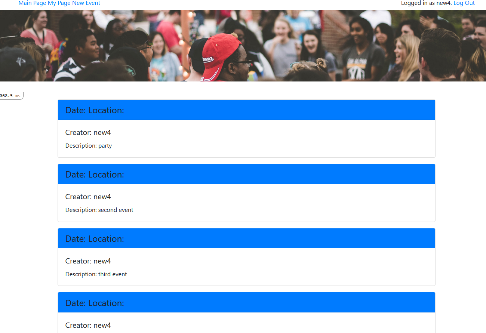

# Rails Programming

## PROJECT: Private events!

## Introduction

In this project we built a site similar to a private Eventbrite which allows users to create events and then manage user signups. Users can create events and send invitations and parties (sound familiar?). Events take place at a specific date and at a location (which you can just store as a string, like “Andy’s House”).
[The Odin Project](https://www.theodinproject.com/courses/ruby-on-rails/lessons/associations).

We used basic concepts of Ruby on Rails including:

- Models, Views, and Controllers (MVC)
- Data Structures & Relationships
- Routing
- Migrations
- Associations
- Views
- RESTful design
- Authentication system
- Adding gems for extra features

## To install and run

- Clone the project repo from [GitHub](https://github.com/Nkuria/private-events) using `git clone https://github.com/Nkuria/private-events`
- Make sure [Ruby-lang](https://www.ruby-lang.org/en/) is installed
- Make sure [Bundler](https://bundler.io/) is installed
- Install the required gems. Run `bundle install`
- Install the locale database. Run `rake db:migrate`
- If you have problems with the gem versions try installing [RVM](https://rvm.io/)
- Launch a Rails Server using `rails server`
- Open your browser and go to `127.0.0.1:3000` or `localhost:3000`

## Private events! app

This is a private events web application where users can create events and invite their friends to the events

The main page will display all the events.

To create a new events you will need to be signed in. If you are not signed in you will be sent to a page with sign in and sign up options. Where you can sign up just using your name
After you have signed in you can create a new events and invite your friends.

You can see the details of the event by clicking it

You will have a sign out link if you are signed in and a sign in button if you are not signed in.

## Designed With
- HTML
- CSS
- Bootstrap
- Ruby
- Rails
- Git
- Gitflows
- Rubocop
- Styleint
- VS Code

## Contribute to this Project

Contributions, issues, and feature requests are welcome! Start by:

  - Forking the project
  - Cloning the project to your local machine
  - cd into the project directory
  - Run git checkout -b your-branch-name
  - Make your contributions
  - Push your branch up to your forked repository
  - Open a Pull Request with a detailed description of the development branch of the original project for a review

## Authors

👤 **Angel Barros**

- GitHub: [@Zappat0n](https://github.com/Zappat0n)
- LinkedIn: [LinkedIn](https://www.linkedin.com/in/angel-barros/)

👤 **Nick Kuria**
- GitHub: [@Nkuria](https://github.com/Nkuria)
- LinkedIn: [LinkedIn](https://www.linkedin.com/in/nkuria)

## Picture by
[Samantha Gades](https://unsplash.com/@srosinger3997?utm_source=unsplash&amp;utm_medium=referral&amp;utm_content=creditCopyText)
on [Unsplash](https://unsplash.com/s/photos/party?utm_source=unsplash&amp;utm_medium=referral&amp;utm_content=creditCopyText)

## Show your support

Give a ⭐️ if you like this project!
